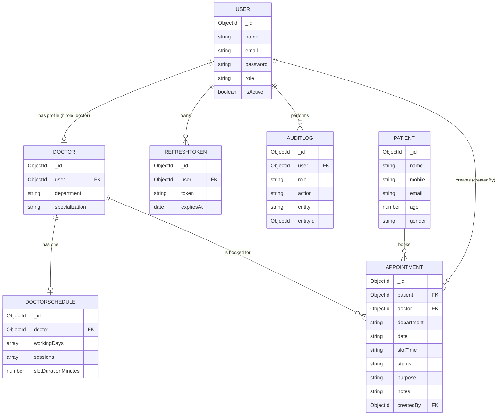

# Enterprise EMR Appointment Management System

A MERN-stack appointment scheduling system for a multi-department clinic, supporting role-based access for Super Admins, Receptionists, and Doctors, with dynamic slot generation and concurrency-safe booking.

## Tech Stack

- **Frontend:** React (Vite), React Router, Axios, plain CSS (design tokens via CSS custom properties)
- **Backend:** Node.js, Express, Mongoose
- **Database:** MongoDB Atlas
- **Auth:** JWT (access + refresh tokens), bcrypt password hashing

## Project Structure

```
mern-emr-appointments/
├── backend/
│   ├── config/          # DB connection
│   ├── controllers/     # Request handlers
│   ├── middlewares/     # authenticate, authorize, error handler
│   ├── models/          # Mongoose schemas
│   ├── routes/          # Express routers
│   ├── services/        # Business logic (slot generation, etc.)
│   ├── utils/           # apiResponse, generateTokens, auditLogger
│   └── server.js
└── frontend/
    └── src/
        ├── components/  # Shared UI (AppLayout, ProtectedRoute)
        ├── context/     # AuthContext
        ├── pages/       # Login, Dashboard, Scheduler, Booking, AppointmentList
        └── services/    # Axios instance + per-resource API calls
```

## Architecture Overview

- **Auth:** Short-lived JWT access tokens (15 min) carry the user's role and are checked on every protected request. Long-lived refresh tokens (7 days) are persisted in the database (`RefreshToken` collection) so logout can genuinely revoke a session server-side, not just clear it client-side.
- **RBAC:** Two-layer Express middleware — `authenticate` (valid token?) then `authorize(...roles)` (correct role?) — applied per-route. The frontend mirrors this by hiding nav items/actions a role can't use, but the backend is the actual enforcement layer.
- **Scheduling:** A doctor's `DoctorSchedule` stores working days, sessions (start/end times), and slot duration as a recurring weekly template. Slots for a specific date are generated on demand by a pure function (`slotService.js`), not pre-computed or stored — this keeps the schedule as the single source of truth and avoids stale generated data if a schedule changes.
- **Concurrency-safe booking:** A MongoDB unique compound index on `(doctor, date, slotTime)`, scoped to non-cancelled statuses via a partial filter expression, guarantees at the database level that two simultaneous booking requests for the same slot cannot both succeed — the second is rejected with a duplicate-key error, which the API translates into a clean `409 Conflict`.

## Database Schema

### Entity Relationship Diagram



### Relationships

- **User → Doctor**: one-to-one, optional (only exists when `role: "doctor"`). Separates login/auth concerns from doctor domain data.
- **Doctor → DoctorSchedule**: one-to-one. A doctor has exactly one active recurring weekly schedule.
- **Doctor / Patient → Appointment**: one-to-many each. An appointment always references exactly one doctor and one patient.
- **User → RefreshToken**: one-to-many. A user can have multiple active refresh tokens (e.g. logged in on multiple devices); each is independently revocable.
- **User → AuditLog**: one-to-many. Every logged action is attributed to the acting user.

### Indexes

| Collection | Index | Type | Purpose |
|---|---|---|---|
| `User` | `email` | unique | Enforce one account per email; fast login lookup |
| `Doctor` | `user` | unique | One doctor profile per user account |
| `DoctorSchedule` | `doctor` | unique | One schedule per doctor |
| `Patient` | `mobile` | standard | Fast lookup during existing-patient search |
| `Patient` | `name` | text | Supports name-based search |
| `Appointment` | `doctor, date, slotTime` | **unique, partial** (`status` not cancelled) | Prevents double-booking at the database level — the core concurrency-safety mechanism |
| `Appointment` | `doctor, date` | standard | Speeds up the common "this doctor's appointments on this date" query, used by both the slot-availability check and the scheduler |
| `Appointment` | `status` | standard | Speeds up status-filtered list queries |

### Sample Documents

**User** (doctor):
```json
{
  "_id": "6a5c934161dc4bb2c7ec758e",
  "name": "Dr. Arjun Mehta",
  "email": "arjun@emr.com",
  "password": "$2b$10$...(bcrypt hash)",
  "role": "doctor",
  "isActive": true
}
```

**Doctor:**
```json
{
  "_id": "6a5c934161dc4bb2c7ec758f",
  "user": "6a5c934161dc4bb2c7ec758e",
  "department": "Cardiology",
  "specialization": "Interventional Cardiology"
}
```

**DoctorSchedule:**
```json
{
  "_id": "6a5ce83e41a71217f6de690c",
  "doctor": "6a5c934161dc4bb2c7ec758f",
  "workingDays": ["monday", "tuesday", "wednesday", "thursday", "friday"],
  "sessions": [
    { "startTime": "09:00", "endTime": "12:00" },
    { "startTime": "13:00", "endTime": "17:00" }
  ],
  "slotDurationMinutes": 15
}
```

**Appointment:**
```json
{
  "_id": "6a5ddd05ec565df3b546c172",
  "patient": "6a5ddd05ec565df3b546c171",
  "doctor": "6a5c934161dc4bb2c7ec758f",
  "department": "Cardiology",
  "date": "2026-07-22",
  "slotTime": "09:00",
  "status": "scheduled",
  "purpose": "Chest pain follow-up",
  "createdBy": "6a5ba354ffa3a354b20a4ae8"
}
```

### Query Optimization Strategy

- Slot availability checks (`GET /slots`) query `Appointment` by `(doctor, date)`, backed by the standard compound index on those fields — avoids a full collection scan on every scheduler page load.
- The booking write itself relies on the unique partial index rather than an application-level "check then insert," turning what would otherwise be a read-then-write race condition into a single atomic database operation.
- `select: false` on `User.password` prevents accidentally fetching password hashes on routine queries, avoiding unnecessary data transfer as much as it avoids a security leak.
- List/search endpoints use `.lean()` where the result is read-only (not going to be saved back), skipping Mongoose document hydration overhead for faster serialization.

## Setup Instructions

### Backend

```bash
cd backend
npm install
```

Create `backend/.env` with:
```
PORT=5000
MONGO_URI=<your MongoDB connection string>
JWT_ACCESS_SECRET=<random secret>
JWT_REFRESH_SECRET=<a different random secret>
JWT_ACCESS_EXPIRY=15m
JWT_REFRESH_EXPIRY=7d
```

Seed the first Super Admin account (required — there is no public registration endpoint by design; see Assumptions):
```bash
npm run seed:admin
```
Default seeded credentials: `admin@emr.com` / `Admin@123`

Start the server:
```bash
npm run dev
```

### Frontend

```bash
cd frontend
npm install
npm run dev
```
Runs at `http://localhost:5173`, expects the backend at `http://localhost:5000`.

## Test Credentials

For evaluation convenience, the following seeded accounts are available (also see the seed script under Setup Instructions):

| Role | Email | Password |
|---|---|---|
| Super Admin | `admin@emr.com` | `Admin@123` |
| Doctor | `arjun@emr.com` | `Doctor@123` |
| Receptionist | `anjali@emr.com` | `Reception@123` |

The Super Admin account is created automatically by `npm run seed:admin`. The Doctor and Receptionist accounts above can be created through the app itself (Super Admin → Doctors → Add Doctor, or `POST /api/v1/users`) — they are not auto-seeded, so create them after first login if they don't already exist in your database.

**Note:** These are test-only credentials for local evaluation, not real production accounts.

## API Overview

All endpoints are prefixed `/api/v1`. All responses follow `{ success, message, data, meta }`.

| Method | Endpoint | Access | Description |
|---|---|---|---|
| POST | `/auth/login` | Public | Login, returns access + refresh tokens |
| POST | `/auth/refresh` | Public (valid refresh token) | Issue a new access token |
| POST | `/auth/logout` | Public (valid refresh token) | Revokes the refresh token server-side |
| POST | `/users` | Super Admin | Create a Doctor or Receptionist account |
| GET | `/doctors` | Any authenticated | List all doctors |
| POST | `/doctors/:id/schedule` | Super Admin | Create/update a doctor's schedule |
| GET | `/slots` | Any authenticated | Get generated slots (available/booked) for a doctor + date |
| POST | `/appointments` | Receptionist, Super Admin | Book an appointment (new or existing patient) |
| GET | `/appointments` | Any authenticated (doctors see only their own) | List, with search/filter/pagination |
| PUT | `/appointments/:id` | Receptionist, Super Admin, Doctor | Update purpose/notes/status |
| DELETE | `/appointments/:id` | Receptionist, Super Admin | Cancel (soft delete) an appointment |
| POST | `/appointments/:id/arrive` | Receptionist, Super Admin | Mark patient as arrived |
| GET | `/patients` | Any authenticated | Search patients by name/mobile |
| GET | `/audit-logs` | Super Admin | View recent system activity |

## Assumptions

- **No public registration endpoint.** Per the RBAC design, only a Super Admin can create Doctor/Receptionist accounts. The very first Super Admin is created via a one-off seed script (`npm run seed:admin`), since no account exists yet to create one through the API.
- **Creating a Doctor account creates both a `User` and a linked `Doctor` profile in a single request.** This guarantees a doctor login can never exist without domain data (department, specialization) attached, simplifying every downstream feature that needs a doctor's profile.
- **One schedule per doctor.** Updating a schedule overwrites the existing one rather than versioning it. A real EMR might need date-ranged schedule versions (e.g. holiday hours) — out of scope here.
- **Tokens are stored in `localStorage` on the frontend**, not an `httpOnly` cookie. Simpler for this timeline, but technically exposed to XSS in a way a cookie-based approach wouldn't be.

## Known Limitations & Future Improvements

- **Real-time updates (Socket.IO) are not implemented.** Given the timeline, this was deprioritized in favor of a fully working, tested REST API and UI. If implemented, the approach would be: emit an event (`appointment:created` / `:updated` / `:cancelled`) from the relevant controller after each DB write, with clients joining a room per `doctor+date`; the Scheduler page would listen and patch its slot state instead of requiring a manual refresh.
- **Appointment search runs on the current page of results, not the full dataset.** `GET /appointments` applies `search` (patient name/mobile) *after* pagination for simplicity. The correct fix is a MongoDB aggregation pipeline (`$lookup` to join `Patient`, then filter, then paginate) — meaningfully more complex, deferred given the timeline.
- **No transaction wrapping `User` + `Doctor` creation.** If `Doctor.create()` fails after `User.create()` succeeds, a doctor login could exist without a profile. A Mongoose transaction would close this gap; not implemented here since the appointment-booking concurrency logic was prioritized as the higher-risk case.
- **Refresh tokens are stored as plain strings**, not hashed, in the database (unlike passwords). Hashing them would mean a database leak alone couldn't be used to impersonate a session.
- **Mobile responsiveness is partial** — the sidebar is hidden below 780px width rather than becoming a collapsible drawer, given the timeline.
